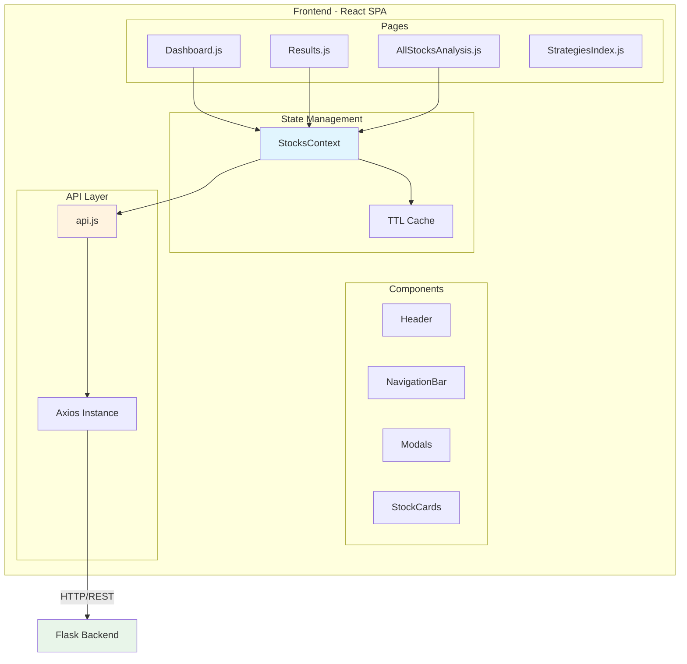
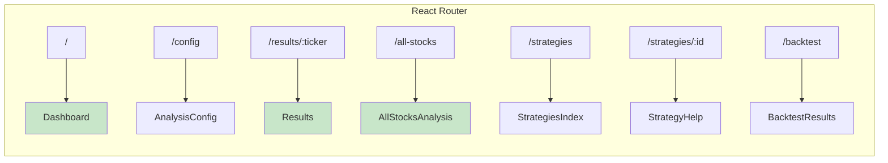
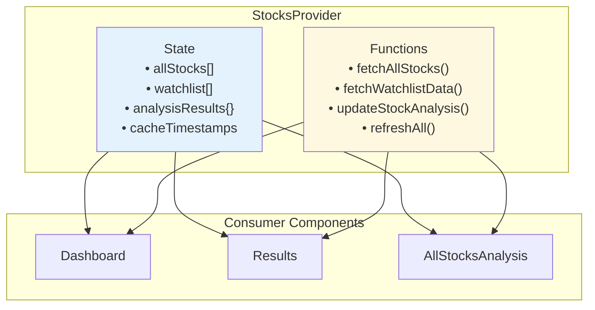
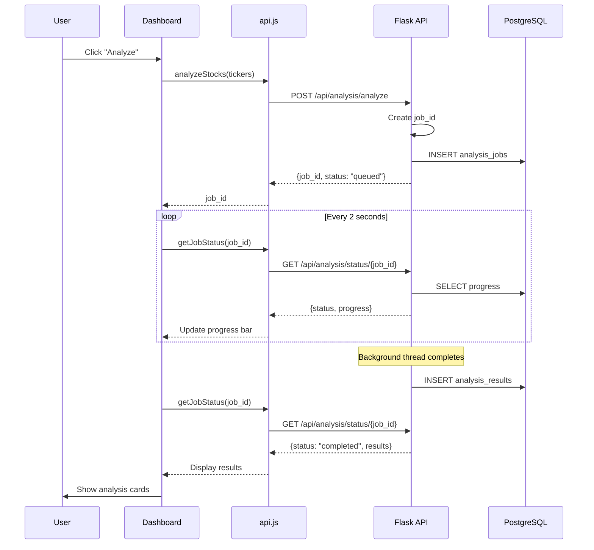
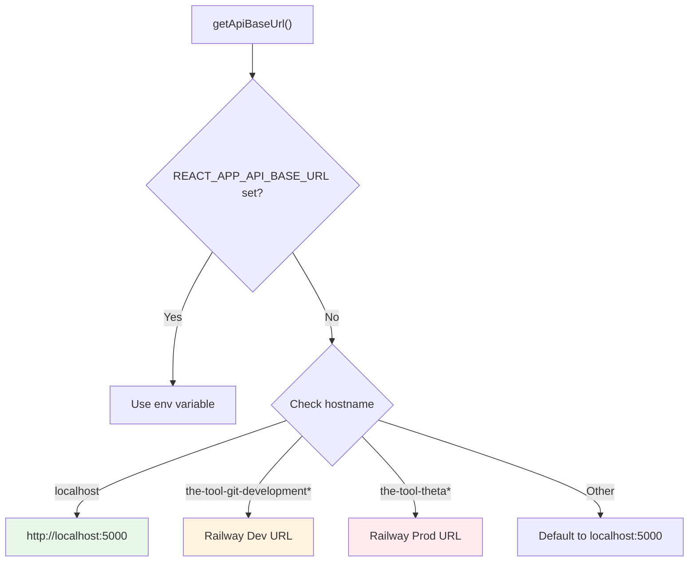
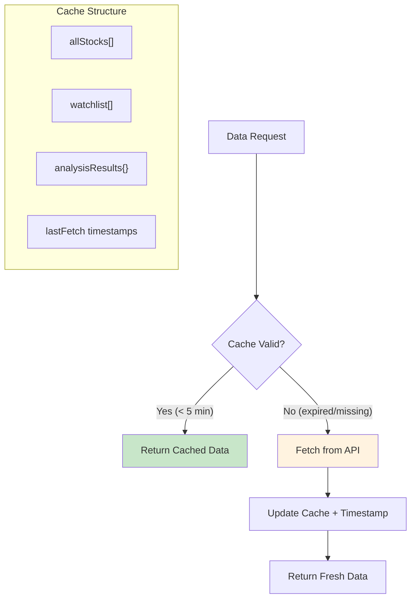
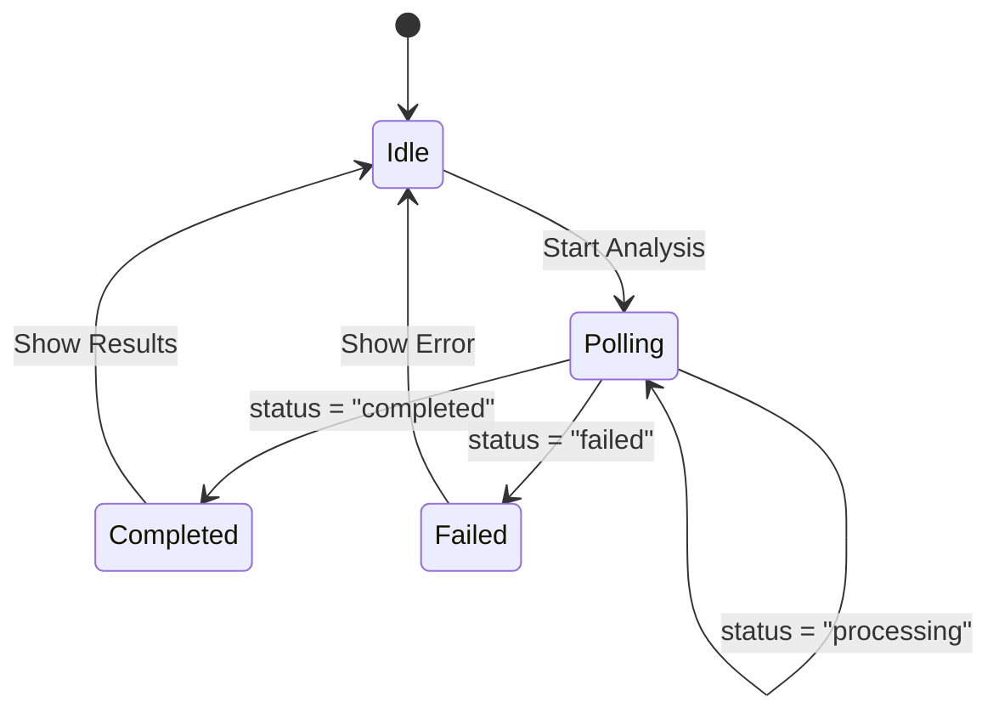
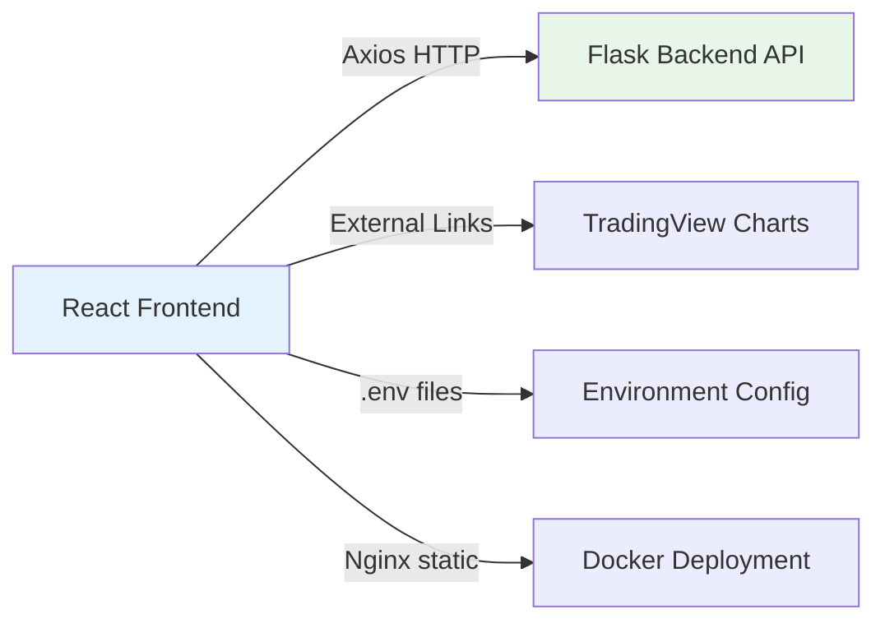

# Frontend Architecture

## Overview

TheTool's frontend is a modern **React 18** single-page application (SPA) that provides a professional trading analysis interface. It communicates with the Flask backend via RESTful APIs and displays real-time stock analysis results.

---

## High-Level Architecture



---

## Technology Stack

| Technology     | Version | Purpose                                          |
| -------------- | ------- | ------------------------------------------------ |
| React          | 18.2    | Core UI framework (functional components, hooks) |
| React Router   | 6.20    | Client-side routing and navigation               |
| Axios          | 1.6.2   | HTTP client for API communication                |
| Tailwind CSS   | 3.3.5   | Utility-first CSS framework for styling          |
| PostCSS        | 8.4.32  | CSS processing and Tailwind compilation          |
| React Markdown | 9.1.0   | Rendering markdown content (strategy help pages) |

---

## Directory Structure

```text
frontend/
├── public/                     # Static assets
├── src/
│   ├── api/
│   │   └── api.js              # Centralized API client
│   │
│   ├── components/             # Reusable UI components
│   │   ├── AddStockModal.js
│   │   ├── AddToWatchlistModal.js
│   │   ├── AnalysisConfigModal.js
│   │   ├── BacktestResults.js
│   │   ├── Breadcrumbs.js
│   │   ├── Header.js
│   │   └── NavigationBar.js
│   │
│   ├── context/
│   │   └── StocksContext.js    # Global state management
│   │
│   ├── pages/                  # Page components (routed views)
│   │   ├── Dashboard.js
│   │   ├── AnalysisConfig.js
│   │   ├── Results.js
│   │   ├── AllStocksAnalysis.js
│   │   ├── StrategiesIndex.js
│   │   └── StrategyHelp.js
│   │
│   ├── utils/
│   │   └── tradingViewUtils.js
│   │
│   ├── App.js                  # Root component with routing
│   ├── index.js                # Application entry point
│   └── index.css               # Global styles
│
├── package.json
├── tailwind.config.js
└── Dockerfile
```

---

## Component Architecture

### Routing Structure



### State Management Pattern



### Component Types

1. **Page Components** (`/pages/`)
   - Full-page views tied to routes
   - Handle data fetching and page-level state
   - Examples: `Dashboard.js`, `Results.js`

2. **UI Components** (`/components/`)
   - Reusable, presentation-focused
   - Receive data via props
   - Examples: `NavigationBar.js`, `AddStockModal.js`

3. **Context Providers** (`/context/`)
   - Manage global application state
   - Provide data caching and utilities
   - Example: `StocksContext.js`

---

## Data Flow Architecture



---

## API Layer Architecture

The frontend uses a centralized API module (`src/api/api.js`):

### Environment Detection



### API Functions

| Category  | Functions                                                              |
| --------- | ---------------------------------------------------------------------- |
| Analysis  | `analyzeStocks()`, `getJobStatus()`, `getReport()`, `downloadReport()` |
| Watchlist | `getWatchlist()`, `addToWatchlist()`, `removeFromWatchlist()`          |
| Stocks    | `getAllNSEStocks()`, `getStockHistory()`                               |
| Strategy  | `getStrategies()`, `getStrategy()`, `getStrategyHelp()`                |

---

## Caching Strategy



**TTL Configuration:**

```javascript
const CACHE_TTL = 5 * 60 * 1000; // 5 minutes

const isCacheValid = (lastFetch) => {
  if (!lastFetch) return false;
  return Date.now() - lastFetch < CACHE_TTL;
};
```

---

## Key Design Patterns

### 1. Container/Presenter Pattern

Pages act as containers (data fetching) while components are presenters (rendering).

### 2. Polling for Real-time Updates



### 3. Optimistic UI Updates

After adding/removing from watchlist, the UI updates immediately without waiting for server confirmation.

### 4. Environment-Based Configuration

API URLs are auto-detected based on hostname, eliminating the need for environment-specific builds.

---

## Styling Approach

The frontend uses **Tailwind CSS** for styling:

```javascript
// Utility Classes Example
<button className="bg-blue-500 hover:bg-blue-700 text-white font-bold py-2 px-4 rounded">
  Analyze
</button>

// Responsive Design
<div className="w-full md:w-1/2 lg:w-1/3">
  {/* Full width on mobile, half on tablet, third on desktop */}
</div>
```

---

## Build & Development

```bash
# Development server (hot reload)
npm run start

# Production build
npm run build

# Run tests
npm run test
```

---

## Integration Points


