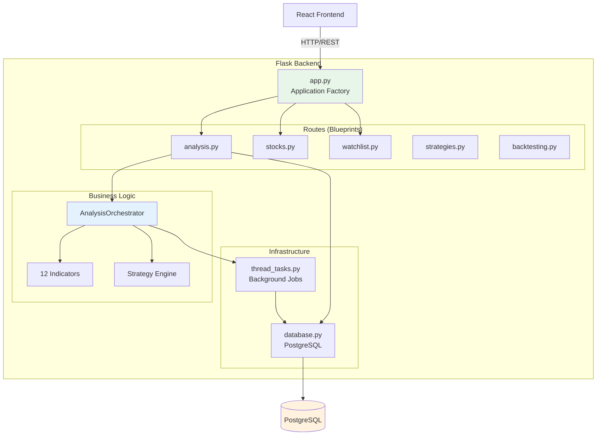
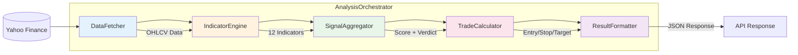
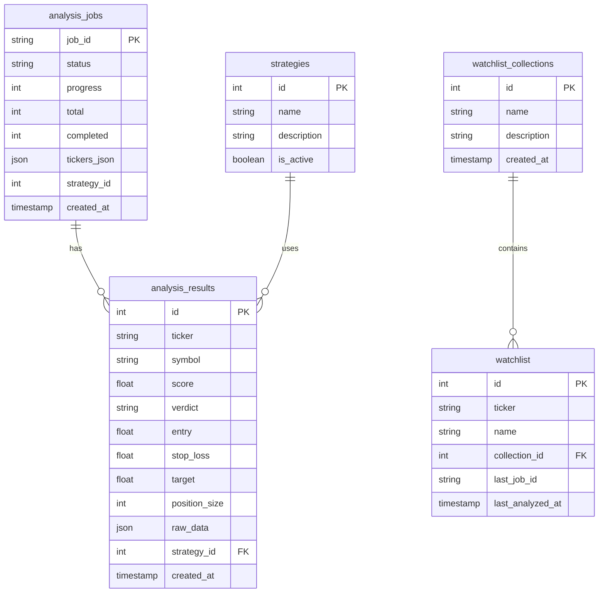
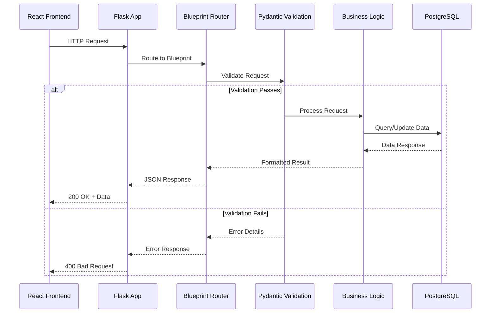

# Backend Architecture

## Overview

TheTool's backend is a **Flask 3.0** REST API server with modular architecture, supporting async job processing, technical indicator calculations, and PostgreSQL data persistence.

---

## Technology Stack

| Technology      | Version | Purpose                         |
| --------------- | ------- | ------------------------------- |
| Python          | 3.13+   | Core runtime                    |
| Flask           | 3.0     | Web framework (REST API)        |
| Flask-CORS      | 4.0     | Cross-Origin Resource Sharing   |
| psycopg2-binary | 2.9.9   | PostgreSQL database driver      |
| pandas          | 2.2.3+  | Data manipulation and analysis  |
| numpy           | 1.26.2+ | Numerical computing             |
| yfinance        | 0.2.66  | Yahoo Finance data fetching     |
| ta              | 0.11.0  | Technical analysis indicators   |
| openpyxl        | 3.1.2   | Excel report generation         |
| Pydantic        | 2.0+    | Data validation and schemas     |
| Flask-Limiter   | 3.5+    | Rate limiting                   |
| numba           | 0.58+   | JIT compilation for performance |

---

## Directory Structure

```
backend/
├── app.py                      # Application factory (Flask app creation)
├── wsgi.py                     # WSGI entry point for production
├── config.py                   # Configuration management
├── database.py                 # PostgreSQL database operations
├── constants.py                # Application constants
├── auth.py                     # Authentication (API key management)
│
├── routes/                     # API Route Blueprints
│   ├── __init__.py
│   ├── analysis.py             # /api/analysis/* - Ticker analysis endpoints
│   ├── stocks.py               # /api/stocks/* - Stock data endpoints
│   ├── watchlist.py            # /api/watchlist/* - Watchlist management
│   ├── watchlist_collections.py # Collection management
│   ├── strategies.py           # /api/strategies/* - Strategy endpoints
│   ├── backtesting.py          # /api/backtesting/* - Backtesting endpoints
│   └── admin.py                # /api/admin/* - Admin operations
│
├── indicators/                 # Technical Indicators (12 total)
│   ├── __init__.py             # Indicator exports
│   ├── base.py                 # Abstract base class (IndicatorBase)
│   ├── registry.py             # Indicator registration and lookup
│   ├── rsi.py                  # RSI (Relative Strength Index)
│   ├── macd.py                 # MACD (Moving Average Convergence Divergence)
│   ├── adx.py                  # ADX (Average Directional Index)
│   ├── bollinger.py            # Bollinger Bands
│   ├── ema.py                  # EMA Crossover (50/200)
│   ├── stochastic.py           # Stochastic Oscillator
│   ├── cci.py                  # CCI (Commodity Channel Index)
│   ├── williams.py             # Williams %R
│   ├── atr.py                  # ATR (Average True Range)
│   ├── psar.py                 # Parabolic SAR
│   ├── obv.py                  # OBV (On-Balance Volume)
│   └── cmf.py                  # CMF (Chaikin Money Flow)
│
├── strategies/                 # Trading Strategies (5 total)
│   ├── __init__.py             # Strategy registration
│   ├── base.py                 # Abstract BaseStrategy class
│   ├── strategy_1.py           # Balanced Analysis
│   ├── strategy_2.py           # Trend Following
│   ├── strategy_3.py           # Mean Reversion
│   ├── strategy_4.py           # Momentum Breakout
│   ├── strategy_5.py           # Weekly 4% Target (Enhanced)
│   └── help/                   # Strategy documentation (markdown)
│
├── utils/                      # Utility Modules
│   ├── analysis_orchestrator.py  # Main analysis pipeline
│   ├── backtesting.py          # Backtesting engine
│   ├── fetch_data.py           # Data fetching utilities
│   ├── data_validator.py       # Input validation
│   ├── entry_calculator.py     # Entry/Exit calculation
│   ├── risk_manager.py         # Risk management
│   ├── signal_validator.py     # Signal validation
│   ├── trade_validator.py      # Trade validation
│   ├── db_utils.py             # Database utilities
│   ├── api_utils.py            # API utilities (error handling, validation)
│   ├── schemas.py              # Pydantic schemas
│   ├── logger.py               # Logging configuration
│   └── timezone_util.py        # Timezone utilities (IST)
│
├── infrastructure/             # Infrastructure modules
│   └── thread_tasks.py         # Background job processing
│
├── models/                     # Data models
│   └── job_state.py            # Job state management
│
├── tests/                      # Test suite
├── data/                       # Local data files (NSE stocks list)
└── requirements.txt            # Python dependencies
```

---

## High-Level Architecture



---

## Application Architecture

### Flask Application Factory Pattern

```python
# app.py
def create_app(config_object=None):
    app = Flask(__name__)

    # 1. Load configuration
    app.config.from_object(config)

    # 2. Configure CORS
    CORS(app, resources={r"/api/*": {"origins": "*"}})

    # 3. Register blueprints
    app.register_blueprint(analysis_bp)
    app.register_blueprint(stocks_bp)
    app.register_blueprint(watchlist_bp)
    app.register_blueprint(strategies_bp)
    app.register_blueprint(backtesting_bp)

    # 4. Initialize database
    init_db_if_needed()

    return app
```

### Blueprint-Based Routing

```
API Routes:
├── /api/analysis/*     ← Analysis operations
│   ├── POST /analyze          - Start analysis job
│   ├── GET  /status/<job_id>  - Get job status
│   ├── POST /cancel/<job_id>  - Cancel job
│   ├── GET  /history/<ticker> - Get analysis history
│   └── GET  /report/<ticker>  - Get detailed report
│
├── /api/stocks/*       ← Stock data operations
│   ├── GET  /nse              - Get NSE stocks list
│   ├── GET  /all              - Paginated stock list
│   ├── POST /analyze-all-stocks - Bulk analysis
│   └── GET  /all-stocks/results - Get all analysis results
│
├── /api/watchlist/*    ← Watchlist operations
│   ├── GET    /               - Get watchlist
│   ├── POST   /               - Add to watchlist
│   └── DELETE /               - Remove from watchlist
│
├── /api/strategies/*   ← Strategy operations
│   ├── GET  /                 - List strategies
│   ├── GET  /<id>             - Get strategy details
│   └── GET  /<id>/help        - Get strategy documentation
│
└── /api/backtesting/*  ← Backtesting operations
    └── POST /run              - Run backtest
```

---

## Core Components

### 1. Analysis Orchestrator (`utils/analysis_orchestrator.py`)

The heart of the analysis pipeline, implementing modular SRP-compliant design:



**Key Classes:**

- `DataFetcher` - Fetches and validates OHLCV data
- `IndicatorEngine` - Calculates all technical indicators
- `SignalAggregator` - Aggregates votes with strategy weighting
- `TradeCalculator` - Calculates entry, stop loss, target prices
- `ResultFormatter` - Formats final analysis response

### 2. Indicator System (`indicators/`)

Using **Template Method Pattern** with abstract base class:

```python
class IndicatorBase(ABC):
    """Abstract base class for all indicators"""

    @abstractmethod
    def calculate(self, df: pd.DataFrame, **params) -> Any:
        """Calculate indicator value"""
        pass

    @abstractmethod
    def _get_vote(self, value: Any, df: pd.DataFrame) -> int:
        """Return -1 (sell), 0 (neutral), or +1 (buy)"""
        pass

    @abstractmethod
    def _get_confidence(self, value: Any, df: pd.DataFrame) -> float:
        """Return confidence score 0.0 to 1.0"""
        pass

    def vote_and_confidence(self, df: pd.DataFrame, **params) -> Dict:
        """Main public method (template method pattern)"""
        value = self.calculate(df, **params)
        return {
            "name": self.name,
            "value": value,
            "vote": self._get_vote(value, df),
            "confidence": self._get_confidence(value, df),
            "category": self.category
        }
```

**Indicator Categories:**
| Category | Indicators |
|----------|------------|
| Trend | EMA Crossover, MACD, ADX, Parabolic SAR |
| Momentum | RSI, Stochastic, CCI, Williams %R |
| Volatility | ATR, Bollinger Bands |
| Volume | OBV, Chaikin Money Flow |

### 3. Strategy System (`strategies/`)

Strategies define indicator weights and risk profiles:

```python
class BaseStrategy(ABC):
    id: int
    name: str
    description: str

    @abstractmethod
    def get_indicator_weights(self) -> Dict[str, float]:
        """Weight multiplier for each indicator"""
        pass

    @abstractmethod
    def get_category_weights(self) -> Dict[str, float]:
        """Weight multiplier for indicator categories"""
        pass

    def get_risk_profile(self) -> Dict[str, Any]:
        """Default risk management settings"""
        return {
            'default_stop_loss_pct': 2.0,
            'default_target_multiplier': 2.0,
            'max_position_size_pct': 20
        }
```

**Available Strategies:**
| ID | Name | Description |
|----|------|-------------|
| 1 | Balanced Analysis | Equal weight to all 12 indicators |
| 2 | Trend Following | Emphasizes MACD, ADX, EMA crossovers |
| 3 | Mean Reversion | Emphasizes RSI, Bollinger, Stochastic |
| 4 | Momentum Breakout | Volume-confirmed momentum signals |
| 5 | Weekly 4% Target | Optimized swing trading strategy |

### 4. Background Job Processing (`infrastructure/thread_tasks.py`)

Using Python's native `threading` module (no Redis/Celery required):

```python
# Job tracking
active_jobs: Dict[str, Dict[str, Any]] = {}
job_threads: Dict[str, threading.Thread] = {}

def start_analysis_job(job_id, tickers, indicators, capital, use_demo):
    """Start background analysis thread"""
    thread = threading.Thread(
        target=analyze_stocks_batch,
        args=(job_id, tickers, capital, indicators, use_demo),
        daemon=False  # Non-daemon for cloud deployments
    )
    thread.start()
    job_threads[job_id] = thread
    return True
```

---

## Database Layer (`database.py`)

### PostgreSQL with Backward Compatibility

The database module maintains SQLite-style query syntax for code compatibility:

```python
def _convert_query_params(query, args):
    """Convert ? placeholders to %s for PostgreSQL"""
    converted = query.replace('?', '%s')
    return converted, args

def query_db(query, args=(), one=False):
    """Execute query with auto-conversion"""
    query, args = _convert_query_params(query, args)
    # ... execute with psycopg2
```

### Database Schema



### Connection Management

**Three connection patterns:**

1. **Flask Request Context** - Uses `g` object for request-scoped connections

   ```python
   def get_db():
       if 'db' not in g:
           g.db = psycopg2.connect(config.DATABASE_URL)
       return g.db
   ```

2. **Background Thread** - Context manager for thread safety

   ```python
   with get_db_session() as (conn, cursor):
       cursor.execute(query, args)
       conn.commit()
   ```

3. **Direct Connection** - For standalone scripts
   ```python
   conn = get_db_connection()
   ```

---

## Request/Response Flow



---

## Error Handling

Standardized error responses via `api_utils.py`:

```python
class StandardizedErrorResponse:
    @staticmethod
    def format(error_code, message, status_code, details=None):
        return jsonify({
            "error": error_code,
            "message": message,
            "details": details,
            "timestamp": get_ist_timestamp()
        }), status_code
```

**Error Codes:**

- `JOB_NOT_FOUND` - Job ID doesn't exist
- `INVALID_TICKER` - Invalid stock ticker
- `ANALYSIS_ERROR` - Analysis failed
- `DATABASE_ERROR` - Database operation failed

---

## Configuration (`config.py`)

Environment-based configuration:

```python
class Config:
    DATABASE_URL = os.getenv('DATABASE_URL')
    DATA_PATH = os.getenv('DATA_PATH', './data')
    LOG_LEVEL = os.getenv('LOG_LEVEL', 'INFO')
    FLASK_ENV = os.getenv('FLASK_ENV', 'development')
```

**Environment Files:**

- `.env` - Local development
- `.env.production` - Production settings
- `.env.example` - Template for new setups

---

## Production Deployment

### Gunicorn Configuration (`gunicorn.conf.py`)

```python
bind = "0.0.0.0:5000"
workers = 4
timeout = 120
worker_class = "sync"
preload_app = True
```

### Docker Configuration

```dockerfile
FROM python:3.13-slim
WORKDIR /app
COPY requirements.txt .
RUN pip install --no-cache-dir -r requirements.txt
COPY . .
CMD ["gunicorn", "--config", "gunicorn.conf.py", "wsgi:app"]
```

---

## Key Design Patterns Used

1. **Application Factory** - Flask app creation in `create_app()`
2. **Blueprint Pattern** - Modular route organization
3. **Template Method** - Indicator base class
4. **Strategy Pattern** - Pluggable trading strategies
5. **Repository Pattern** - Database abstraction in `database.py`
6. **Factory Pattern** - Indicator creation via registry
7. **Context Manager** - Thread-safe database sessions
