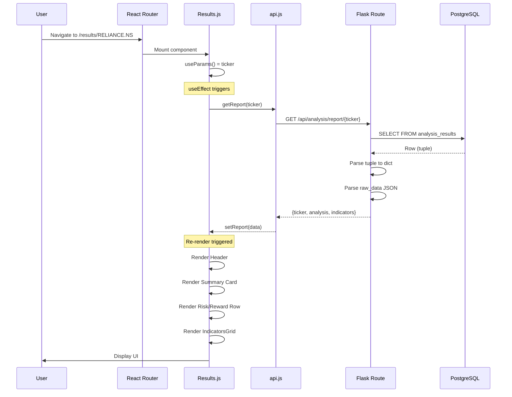

# Complete Lifecycle: Database → Backend → Frontend (Data Read)

## Overview

This document traces the complete journey of fetching analysis data from the database, processing it in the backend, and visualizing it on the frontend.

---

## Scenario: User Views Analysis Results

**Action:** User navigates to the Results page for ticker "RELIANCE.NS" to see detailed analysis.

---

## Phase 1: Frontend - Navigation and Request

### Step 1.1: User Navigation

```javascript
// frontend/src/pages/Dashboard.js

const handleViewStock = (ticker) => {
  // User clicks on a stock row or "View Details" button
  navigate(`/results/${ticker}`); // Navigate to /results/RELIANCE.NS
};
```

### Step 1.2: Results Page Component Mount

```javascript
// frontend/src/pages/Results.js

import { useParams } from "react-router-dom";
import { getReport, getStockHistory } from "../api/api";

function Results() {
  // Extract ticker from URL parameter
  const { ticker } = useParams(); // "RELIANCE.NS"

  const [report, setReport] = useState(null);
  const [history, setHistory] = useState([]);
  const [loading, setLoading] = useState(true);
  const [error, setError] = useState(null);

  useEffect(() => {
    const fetchData = async () => {
      setLoading(true);
      try {
        // Fetch detailed report
        const reportData = await getReport(ticker);
        setReport(reportData);

        // Fetch analysis history
        const historyData = await getStockHistory(ticker);
        setHistory(historyData.history || []);
      } catch (err) {
        setError(err.message);
      } finally {
        setLoading(false);
      }
    };

    fetchData();
  }, [ticker]); // Re-fetch when ticker changes

  // ... render logic
}
```

### Step 1.3: API Layer Calls

```javascript
// frontend/src/api/api.js (lines 103-106)

export const getReport = async (ticker) => {
  const response = await api.get(`/api/analysis/report/${ticker}`);
  return response.data;
};

// Line 178-181
export const getStockHistory = async (symbol) => {
  const response = await api.get(`/api/analysis/history/${symbol}`);
  return response.data;
};
```

**HTTP Requests Sent:**

```http
GET http://localhost:5000/api/analysis/report/RELIANCE.NS
Accept: application/json
X-API-Key: [API_KEY]

GET http://localhost:5000/api/analysis/history/RELIANCE.NS
Accept: application/json
X-API-Key: [API_KEY]
```

---

## Phase 2: Backend - Route Handling

### Step 2.1: Report Endpoint Handler

```python
# backend/routes/analysis.py (lines 419-522)

@bp.route("/report/<ticker>", methods=["GET"])
def get_report(ticker):
    """Get detailed analysis report for a ticker"""

    try:
        # Validate ticker
        if not ticker or len(ticker.strip()) == 0:
            return StandardizedErrorResponse.format(
                "INVALID_TICKER",
                "Ticker cannot be empty",
                400
            )

        logger.info(f"[REPORT] Querying for ticker: {ticker}")

        # Query latest analysis from database (Step 2.2)
        result = query_db(
            """
            SELECT verdict, score, entry, stop_loss, target, created_at, raw_data,
                   position_size, risk_reward_ratio, analysis_config, strategy_id
            FROM analysis_results
            WHERE LOWER(ticker) = LOWER(?)
            ORDER BY created_at DESC
            LIMIT 1
            """,
            (ticker,),
            one=True
        )

        logger.info(f"[REPORT] Query result for {ticker}: {result is not None}")

        if not result:
            return StandardizedErrorResponse.format(
                "REPORT_NOT_FOUND",
                f"No analysis found for {ticker}",
                404
            )

        # Parse result (Step 2.3)
        # ... parsing logic

        return jsonify({
            "ticker": ticker,
            "analysis": analysis_data,
            "indicators": indicators,
            "created_at": created_at,
            "analysis_config": config_data
        }), 200
```

### Step 2.2: Database Query Execution

```python
# backend/database.py (lines 65-75)

def query_db(query, args=(), one=False):
    """Query database and return results"""

    # Convert ? placeholders to %s for PostgreSQL
    query, args = _convert_query_params(query, args)

    # Get connection from Flask request context
    db = get_db()

    # Execute query
    cur = db.cursor()
    cur.execute(query, args)
    rv = cur.fetchall()
    cur.close()

    # Return single row or all rows
    return (rv[0] if rv else None) if one else rv
```

**SQL Query Executed:**

```sql
SELECT verdict, score, entry, stop_loss, target, created_at, raw_data,
       position_size, risk_reward_ratio, analysis_config, strategy_id
FROM analysis_results
WHERE LOWER(ticker) = LOWER('RELIANCE.NS')
ORDER BY created_at DESC
LIMIT 1;
```

**Query Result (from PostgreSQL):**

```
('Strong Buy', 72.5, 2450.50, 2400.25, 2550.75,
 '2024-01-15 10:30:05+05:30',
 '[{"name":"RSI","value":55.2,"vote":0,"confidence":0.6,"category":"momentum"},{"name":"MACD","value":12.5,"vote":1,"confidence":0.8,"category":"trend"},...]',
 20, 2.0,
 '{"capital":100000,"risk_percent":2.0}',
 1)
```

### Step 2.3: Parse and Transform Database Result

```python
# backend/routes/analysis.py (continued)

        # Handle both tuple (PostgreSQL) and dict (SQLite) return types
        if isinstance(result, (tuple, list)):
            # PostgreSQL returns tuples
            analysis_data = {
                "verdict": result[0],           # "Strong Buy"
                "score": result[1],             # 72.5
                "entry": result[2],             # 2450.50
                "stop_loss": result[3],         # 2400.25
                "target": result[4],            # 2550.75
                "position_size": result[7] or 0,    # 20
                "risk_reward_ratio": result[8] or 0, # 2.0
                "strategy_id": result[10] or 1       # 1
            }
            created_at = result[5]              # "2024-01-15 10:30:05+05:30"
            raw_data = result[6]                # JSON string of indicators
            analysis_config = result[9]         # JSON string of config

        # Parse analysis_config JSON
        config_data = None
        if analysis_config:
            try:
                config_data = json.loads(analysis_config) if isinstance(analysis_config, str) else analysis_config
            except json.JSONDecodeError:
                logger.warning(f"Failed to parse analysis_config JSON for {ticker}")

        # Parse indicators from raw_data JSON
        indicators = []
        if raw_data:
            try:
                indicators = json.loads(raw_data) if isinstance(raw_data, str) else raw_data
            except json.JSONDecodeError:
                logger.warning(f"Failed to parse raw_data JSON for {ticker}")
                indicators = []

        # Build response
        return jsonify({
            "ticker": ticker,
            "analysis": analysis_data,
            "indicators": indicators,
            "created_at": created_at,
            "analysis_config": config_data
        }), 200
```

**HTTP Response:**

```json
{
  "ticker": "RELIANCE.NS",
  "analysis": {
    "verdict": "Strong Buy",
    "score": 72.5,
    "entry": 2450.5,
    "stop_loss": 2400.25,
    "target": 2550.75,
    "position_size": 20,
    "risk_reward_ratio": 2.0,
    "strategy_id": 1
  },
  "indicators": [
    {
      "name": "RSI",
      "value": 55.2,
      "vote": 0,
      "confidence": 0.6,
      "category": "momentum"
    },
    {
      "name": "MACD",
      "value": 12.5,
      "vote": 1,
      "confidence": 0.8,
      "category": "trend"
    },
    {
      "name": "ADX",
      "value": 28.3,
      "vote": 1,
      "confidence": 0.7,
      "category": "trend"
    },
    {
      "name": "Parabolic SAR",
      "value": 2420.15,
      "vote": 1,
      "confidence": 0.75,
      "category": "trend"
    },
    {
      "name": "EMA Crossover",
      "value": { "ema_50": 2430.25, "ema_200": 2380.5 },
      "vote": 1,
      "confidence": 0.85,
      "category": "trend"
    },
    {
      "name": "Stochastic",
      "value": { "k": 65.5, "d": 62.3 },
      "vote": 0,
      "confidence": 0.55,
      "category": "momentum"
    },
    {
      "name": "CCI",
      "value": 85.7,
      "vote": 0,
      "confidence": 0.5,
      "category": "momentum"
    },
    {
      "name": "Williams %R",
      "value": -35.2,
      "vote": 0,
      "confidence": 0.6,
      "category": "momentum"
    },
    {
      "name": "ATR",
      "value": 45.75,
      "vote": 0,
      "confidence": 0.5,
      "category": "volatility"
    },
    {
      "name": "Bollinger Bands",
      "value": { "upper": 2520.5, "middle": 2445.25, "lower": 2370.0 },
      "vote": 0,
      "confidence": 0.45,
      "category": "volatility"
    },
    {
      "name": "OBV",
      "value": 125000000,
      "vote": 1,
      "confidence": 0.7,
      "category": "volume"
    },
    {
      "name": "Chaikin Money Flow",
      "value": 0.15,
      "vote": 1,
      "confidence": 0.65,
      "category": "volume"
    }
  ],
  "created_at": "2024-01-15T10:30:05+05:30",
  "analysis_config": {
    "capital": 100000,
    "risk_percent": 2.0
  }
}
```

---

## Phase 3: Frontend - Data Rendering

### Step 3.1: State Update

```javascript
// frontend/src/pages/Results.js

useEffect(() => {
  const fetchData = async () => {
    setLoading(true);
    try {
      const reportData = await getReport(ticker);
      setReport(reportData);
      // reportData = {
      //   ticker: "RELIANCE.NS",
      //   analysis: { verdict: "Strong Buy", score: 72.5, ... },
      //   indicators: [...],
      //   created_at: "2024-01-15T10:30:05+05:30"
      // }
    } catch (err) {
      setError(err.message);
    } finally {
      setLoading(false);
    }
  };
  fetchData();
}, [ticker]);
```

### Step 3.2: Render Analysis Summary

```javascript
// frontend/src/pages/Results.js - Render section

function Results() {
  // ... state and effect hooks

  if (loading) {
    return (
      <div className="flex justify-center p-8">
        <Spinner />
      </div>
    );
  }

  if (error) {
    return <div className="text-red-500 p-4">Error: {error}</div>;
  }

  if (!report) {
    return (
      <div className="text-gray-500 p-4">No analysis found for {ticker}</div>
    );
  }

  const { analysis, indicators, created_at } = report;

  return (
    <div className="container mx-auto p-4">
      {/* Header Section */}
      <header className="mb-8">
        <h1 className="text-3xl font-bold">{ticker}</h1>
        <p className="text-gray-500">
          Last analyzed: {new Date(created_at).toLocaleString()}
        </p>
      </header>

      {/* Summary Card */}
      <div className="bg-white rounded-lg shadow-lg p-6 mb-6">
        <div className="grid grid-cols-2 md:grid-cols-4 gap-4">
          {/* Verdict */}
          <div className="text-center">
            <h3 className="text-lg font-semibold text-gray-600">Verdict</h3>
            <p
              className={`text-2xl font-bold ${getVerdictColor(analysis.verdict)}`}
            >
              {analysis.verdict}
            </p>
          </div>

          {/* Score */}
          <div className="text-center">
            <h3 className="text-lg font-semibold text-gray-600">Score</h3>
            <p className="text-2xl font-bold text-blue-600">
              {analysis.score.toFixed(1)}%
            </p>
          </div>

          {/* Entry Price */}
          <div className="text-center">
            <h3 className="text-lg font-semibold text-gray-600">Entry</h3>
            <p className="text-2xl font-bold text-green-600">
              ₹{analysis.entry?.toFixed(2)}
            </p>
          </div>

          {/* Target Price */}
          <div className="text-center">
            <h3 className="text-lg font-semibold text-gray-600">Target</h3>
            <p className="text-2xl font-bold text-green-600">
              ₹{analysis.target?.toFixed(2)}
            </p>
          </div>
        </div>

        {/* Risk/Reward Row */}
        <div className="mt-4 pt-4 border-t grid grid-cols-3 gap-4">
          <div className="text-center">
            <h4 className="text-sm text-gray-500">Stop Loss</h4>
            <p className="text-lg font-semibold text-red-600">
              ₹{analysis.stop_loss?.toFixed(2)}
            </p>
          </div>
          <div className="text-center">
            <h4 className="text-sm text-gray-500">Position Size</h4>
            <p className="text-lg font-semibold">
              {analysis.position_size} shares
            </p>
          </div>
          <div className="text-center">
            <h4 className="text-sm text-gray-500">Risk/Reward</h4>
            <p className="text-lg font-semibold text-blue-600">
              1:{analysis.risk_reward_ratio?.toFixed(1)}
            </p>
          </div>
        </div>
      </div>

      {/* Indicators Section */}
      <IndicatorsGrid indicators={indicators} />
    </div>
  );
}
```

### Step 3.3: Render Indicators Grid

```javascript
// frontend/src/pages/Results.js - IndicatorsGrid component

function IndicatorsGrid({ indicators }) {
  // Group indicators by category
  const grouped = indicators.reduce((acc, ind) => {
    const category = ind.category || "other";
    if (!acc[category]) acc[category] = [];
    acc[category].push(ind);
    return acc;
  }, {});

  const categories = ["trend", "momentum", "volatility", "volume"];

  return (
    <div className="bg-white rounded-lg shadow-lg p-6">
      <h2 className="text-xl font-bold mb-4">Technical Indicators</h2>

      <div className="grid grid-cols-1 md:grid-cols-2 lg:grid-cols-4 gap-4">
        {categories.map((category) => (
          <div key={category} className="border rounded-lg p-4">
            <h3 className="text-lg font-semibold capitalize mb-3 text-gray-700">
              {category}
            </h3>

            {grouped[category]?.map((indicator) => (
              <IndicatorCard key={indicator.name} indicator={indicator} />
            ))}
          </div>
        ))}
      </div>
    </div>
  );
}

function IndicatorCard({ indicator }) {
  const voteColor =
    indicator.vote === 1
      ? "text-green-500"
      : indicator.vote === -1
        ? "text-red-500"
        : "text-gray-500";

  const voteLabel =
    indicator.vote === 1 ? "Buy" : indicator.vote === -1 ? "Sell" : "Neutral";

  // Format value based on type
  const formatValue = (value) => {
    if (typeof value === "object") {
      return Object.entries(value)
        .map(([k, v]) => `${k}: ${typeof v === "number" ? v.toFixed(2) : v}`)
        .join(", ");
    }
    return typeof value === "number" ? value.toFixed(2) : value;
  };

  return (
    <div className="bg-gray-50 rounded p-3 mb-2">
      <div className="flex justify-between items-center">
        <span className="font-medium">{indicator.name}</span>
        <span className={`font-bold ${voteColor}`}>{voteLabel}</span>
      </div>
      <div className="text-sm text-gray-600 mt-1">
        Value: {formatValue(indicator.value)}
      </div>
      <div className="text-xs text-gray-400">
        Confidence: {(indicator.confidence * 100).toFixed(0)}%
      </div>
    </div>
  );
}
```

### Step 3.4: Verdict Color Helper

```javascript
// frontend/src/pages/Dashboard.js (lines 21-38)

function getVerdictColor(verdict) {
  switch (verdict?.toLowerCase()) {
    case "strong buy":
      return "text-green-600";
    case "buy":
      return "text-green-500";
    case "hold":
      return "text-yellow-500";
    case "sell":
      return "text-red-500";
    case "strong sell":
      return "text-red-600";
    default:
      return "text-gray-500";
  }
}
```

---

## Phase 4: UI Rendered

### Final Visual Output

```
┌─────────────────────────────────────────────────────────────────────┐
│  RELIANCE.NS                                                        │
│  Last analyzed: Jan 15, 2024, 10:30:05 AM                          │
├─────────────────────────────────────────────────────────────────────┤
│                                                                     │
│   ┌───────────┐  ┌───────────┐  ┌───────────┐  ┌───────────┐       │
│   │  Verdict  │  │   Score   │  │   Entry   │  │  Target   │       │
│   │           │  │           │  │           │  │           │       │
│   │ STRONG    │  │   72.5%   │  │ ₹2,450.50 │  │ ₹2,550.75 │       │
│   │   BUY     │  │           │  │           │  │           │       │
│   └───────────┘  └───────────┘  └───────────┘  └───────────┘       │
│                                                                     │
│   ┌─────────────────┬────────────────┬─────────────────┐           │
│   │    Stop Loss    │  Position Size │   Risk/Reward   │           │
│   │    ₹2,400.25    │   20 shares    │     1:2.0       │           │
│   └─────────────────┴────────────────┴─────────────────┘           │
│                                                                     │
├─────────────────────────────────────────────────────────────────────┤
│  TECHNICAL INDICATORS                                               │
│                                                                     │
│  ┌─────────────┐ ┌─────────────┐ ┌─────────────┐ ┌─────────────┐   │
│  │   TREND     │ │  MOMENTUM   │ │ VOLATILITY  │ │   VOLUME    │   │
│  ├─────────────┤ ├─────────────┤ ├─────────────┤ ├─────────────┤   │
│  │ EMA Cross   │ │    RSI      │ │    ATR      │ │    OBV      │   │
│  │   ▲ Buy     │ │   ─ Neutral │ │   ─ Neutral │ │   ▲ Buy     │   │
│  │ 2430/2380   │ │    55.2     │ │   45.75     │ │  125M       │   │
│  │ Conf: 85%   │ │  Conf: 60%  │ │  Conf: 50%  │ │  Conf: 70%  │   │
│  ├─────────────┤ ├─────────────┤ ├─────────────┤ ├─────────────┤   │
│  │    MACD     │ │ Stochastic  │ │  Bollinger  │ │    CMF      │   │
│  │   ▲ Buy     │ │   ─ Neutral │ │   ─ Neutral │ │   ▲ Buy     │   │
│  │    12.5     │ │   65.5/62.3 │ │ 2520/2370   │ │   0.15      │   │
│  │ Conf: 80%   │ │  Conf: 55%  │ │  Conf: 45%  │ │  Conf: 65%  │   │
│  ├─────────────┤ ├─────────────┤ └─────────────┘ └─────────────┘   │
│  │    ADX      │ │    CCI      │                                   │
│  │   ▲ Buy     │ │   ─ Neutral │                                   │
│  │    28.3     │ │    85.7     │                                   │
│  │ Conf: 70%   │ │  Conf: 50%  │                                   │
│  ├─────────────┤ ├─────────────┤                                   │
│  │    PSAR     │ │ Williams %R │                                   │
│  │   ▲ Buy     │ │   ─ Neutral │                                   │
│  │  2420.15    │ │   -35.2     │                                   │
│  │ Conf: 75%   │ │  Conf: 60%  │                                   │
│  └─────────────┘ └─────────────┘                                   │
│                                                                     │
└─────────────────────────────────────────────────────────────────────┘
```

---

## Complete Data Flow Diagram



---

## Key Code Files Reference

| File                            | Purpose                | Key Lines         |
| ------------------------------- | ---------------------- | ----------------- |
| `frontend/src/pages/Results.js` | Results page component | useEffect, render |
| `frontend/src/api/api.js`       | API call functions     | lines 103-106     |
| `backend/routes/analysis.py`    | Report endpoint        | lines 419-522     |
| `backend/database.py`           | Database query         | lines 65-75       |

---

## Data Transformation Summary

| Stage           | Data Format            |
| --------------- | ---------------------- |
| Database        | PostgreSQL row (tuple) |
| Backend handler | Python dict            |
| HTTP response   | JSON string            |
| Frontend API    | JavaScript object      |
| React state     | JavaScript object      |
| UI render       | JSX elements           |
